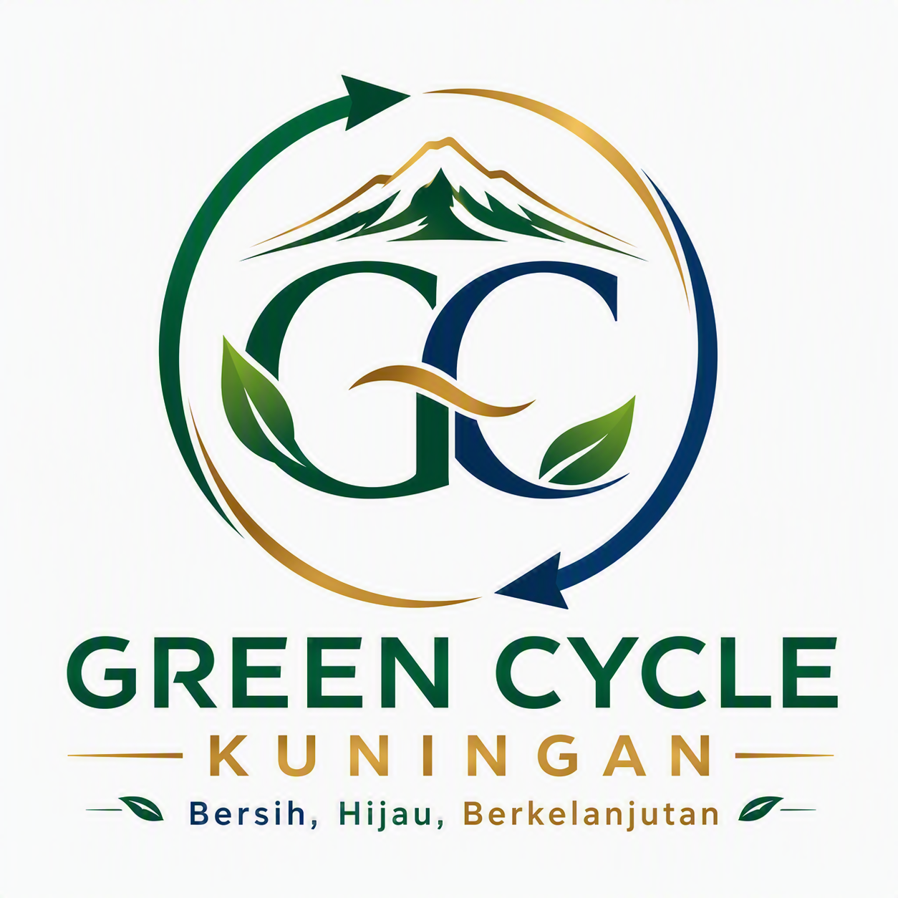

<div align="center">
  
  <h1>Green Cycle Kuningan</h1>
  <p><strong>Sistem Informasi ERP & Kasir Timbangan Digital Terintegrasi 4 Gudang</strong></p>
  <p><em>"Bersih, Hijau, Berkelanjutan"</em></p>

  <p>
    
    
    
    
    
    
  </p>
</div>

---

## 📌 Ringkasan Sistem

**Green Cycle Kuningan** adalah platform SaaS & ERP operasional gudang rongsok/scrap logam multi-cabang (Gudang 1, 2, 3, dan 4) yang mengotomasi penimbangan digital, pencatatan kas masuk/keluar, absensi kuli, mutasi stok, hingga konsolidasi laba rugi level eksekutif (Owner).

Sistem didesain dengan prinsip **Daylight-Friendly High Contrast UI** (Forest Green, Golden Ochre, Deep Navy) yang ramah mata untuk pencahayaan terik siang hari di area timbangan gudang, serta dilengkapi arsitektur **Offline-First** untuk menjamin transaksi tidak pernah berhenti saat sinyal internet drop.

---

## 🚀 Fitur Utama & Modul Bisnis

### 1. Kasir POS Timbangan Digital (Multi-Item)
- **Web Serial RS-232**: Integrasi langsung ke indikator timbangan digital fisik (Alexa BFS / A12E) dengan fallback simulator berat virtual.
- **Auto Refaksi**: Perhitungan potongan kotoran (refaksi Kg atau Persen %).
- **Opsi Bebas & Cepat**: Pilihan kategori mitra (Langganan vs Eceran), input nama penjual bebas, dan input komoditas bebas bila belum terdaftar di master.
- **Estimasi Kasir**: Kalkulasi otomatis uang diserahkan, tombol pecahan cepat (*quick cash*), dan deteksi sisa kembalian / kurang bayar.
- **ESC/POS Thermal Printing**: Struk otomatis siap cetak via printer thermal 58mm/80mm.

### 2. Penjualan Stok Gudang (Kas Masuk)
- Pencatatan pengeluaran stok tonase ke **Pabrik Peleburan Besar** (kontrak tempo) atau **Pembeli Biasa / Bengkel Eceran** (tunai langsung).
- **Alokasi Kas**: Fleksibilitas penerimaan masuk ke **Laci Kasir Tunai** (menambah saldo laci harian) atau **Transfer Rekening Bank**.

### 3. Kontrol Shift & Rekonsiliasi Kasir Laci
- **Formula Kas Laci Riil**:
  $$\text{Uang Fisik Seharusnya} = \text{Modal Awal} + \text{Penjualan Tunai Laci} - \text{Belanja Timbangan}$$
- Pencegahan selisih kas fisik laci (deteksi otomatis *Surplus* / *Tekor* kasir harian).

### 4. Absensi Cepat 50 Karyawan & Kasbon
- **UX Friendly Checklist**: Tombol *1-Klik Hadir Semua* untuk efisiensi admin menyelesaikan absensi 50 pekerja sortir & kuli dalam 15 detik.
- **Pencatatan Kasbon**: Tracking pinjaman kasbon mingguan dan otomatis siap dipotong saat penggajian.

### 5. Biaya Operasional Gudang (OPEX)
- Pencatatan kas kecil (*petty cash*) terpisah dari uang laci timbangan (Bensin/Solar Truk, Karung & Plastik, Kawat Ikat, Servis Timbangan, Konsumsi Lembur).
- Dukungan input kategori biaya bebas/kustom.

### 6. Mutasi Tonase Antar Gudang
- Penerbitan Surat Jalan (*SJ*) resmi untuk konsolidasi scrap dari Gudang 1, 2, 3, dan 4.
- Tracking nomor plat armada truk, nama sopir pengangkut, dan tombol konfirmasi penerimaan barang di gudang tujuan.

### 7. Manajemen Hutang & Piutang (AP / AR)
- **Piutang Pabrik**: Pemantauan invoice tempo penjualan tonase ke pabrik peleburan.
- **Hutang Pengepul**: Monitoring titip timbang rongsok supplier yang belum mengambil uang tunai.
- Fitur input cicilan pembayaran bertahap.

### 8. Executive Overview (Owner Dashboard)
- **Proteksi Akses RBAC**: Tersembunyi penuh dari role Kasir (ADMIN) demi kerahasiaan keuangan perusahaan.
- **Smart Price Fluctuation**: Monitoring spread margin keuntungan antara harga beli di timbangan vs patokan pasar.
- **Approval Transaksi Jumbo**: Verifikasi otorisasi transaksi nota > Rp 10.000.000.
- **Multi-Sheet Excel Export**: Generator otomatis laporan konsolidasi 5 sheets (`.xlsx`).

---

## 🏗️ Tech Stack & Arsitektur

| Layer | Teknologi |
| :--- | :--- |
| **Frontend Framework** | [Next.js 15 (App Router)](https://nextjs.org/) + React 19 |
| **Language** | TypeScript (Strict Type Safety) |
| **Styling & UI** | Tailwind CSS v4, Lucide React Icons |
| **Database & Auth** | Supabase (PostgreSQL, Row Level Security) |
| **Offline Cache** | Dexie.js (IndexedDB Client Sync) |
| **Hardware Hook** | Web Serial API (`navigator.serial`) + WebUSB / RawBT ESC/POS |
| **Reporting** | SheetJS (Excel Multi-Sheet XLSX Generator) |

---

## 📁 Struktur Direktori

```text
SAAS-kuningan-green-recycle/
├── docs/                      # Dokumentasi SDLC Lengkap
│   ├── prd/                   # Product Requirements Document
│   ├── srs/                   # Software Requirements Specification
│   ├── adr/                   # Architecture Decision Records
│   ├── plans/                 # Detailed Implementation Plans
│   └── devlogs/               # Log Pengembangan Real-time
├── fe/                        # Frontend Next.js Project
│   ├── app/                   # App Router Pages & Layouts
│   ├── components/
│   │   ├── attendance/        # Modul Absensi 50 Karyawan & Kasbon
│   │   ├── debt/              # Modul Hutang & Piutang (AP/AR)
│   │   ├── layout/            # Sidebar & Topbar Navigasi
│   │   ├── mutation/          # Modul Surat Jalan Mutasi Gudang
│   │   ├── opex/              # Modul Kas Kecil Operasional
│   │   ├── owner/             # Modul Executive Owner Dashboard
│   │   ├── pos/               # Modul Kasir Timbangan Digital POS
│   │   ├── sales/             # Modul Penjualan Stok (Kas Masuk)
│   │   └── shifts/            # Modul Shift & Rekonsiliasi Kasir
│   ├── lib/
│   │   ├── db/                # Dexie.js IndexedDB Schema
│   │   ├── export/            # Multi-sheet Excel Generator
│   │   ├── hardware/          # Web Serial RS-232 & ESC/POS Builder
│   │   └── mock/              # Master Data 4 Gudang, Produk & Karyawan
│   ├── public/                # Brand Assets & Logo Resmi GC
│   └── types/                 # Enterprise Domain TypeScript Definitions
└── supabase/
    └── migrations/            # Skema SQL DDL & Indeks PostgreSQL
```

---

## ⚙️ Panduan Menjalankan Proyek

### Prasyarat
- Node.js v18.18+ atau v20+
- npm / yarn / pnpm

### 1. Kloning Repositori
```bash
git clone https://github.com/timbubadibako/SAAS-kuningan-green-recycle.git
cd SAAS-kuningan-green-recycle/fe
```

### 2. Instalasi Dependensi
```bash
npm install
```

### 3. Konfigurasi Environment Variable
Buat file `.env.local` di folder `fe/`:
```env
NEXT_PUBLIC_SUPABASE_URL=your_supabase_project_url
NEXT_PUBLIC_SUPABASE_ANON_KEY=your_supabase_anon_key
```

### 4. Menjalankan Server Development
```bash
npm run dev
```
Buka browser di [http://localhost:3000](http://localhost:3000).

---

## ⚖️ Lisensi
Hak Cipta © 2026 **Green Cycle Kuningan**. Seluruh hak cipta dilindungi undang-undang.
